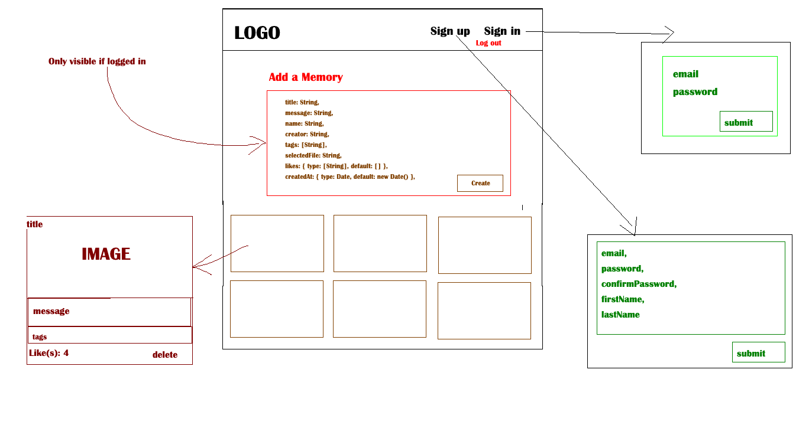

# MERN (MongoDB + Express + React + Node)

1. PART 1: https://www.youtube.com/watch?v=ngc9gnGgUdA
2. PART 2: https://www.youtube.com/watch?v=aibtHnbeuio&t=0s
3. PART 3: https://www.youtube.com/watch?v=LKlO8vLvUao

## 🛢 DataBase (MongoDB)

- Access MongoDB Atlas at https://cloud.mongodb.com/

- Create the Project, the User, configure the Network access, Cluster and finally get the CONNECTION_STRING

## 🤖 Server

- Initialise and *package.json* file

    ```bash
        npm init -y
    ```

- npm install ... 

    ```bash
        npm install express cors mongoose@5.11.15 nodemon dotenv bcryptjs jsonwebtoken
    ```

-  Update *package.json* adding these lines:

    ```json
        {
            "name": "server",
            "version": "1.0.0",
            "description": "",
            "main": "index.js",
            //This-allow-us-to-use-import-syntax-on-files
            "type": "module"
            "scripts": {
                //This-will-re-run-the-server-automatically-after-changes
                "start" : "nodemon index.js" 
            },
            ...
        }
    ```
- Steps:
    1. index.js
        - In the index...
            - Define the App
            - Define the Routes
            - Create the connection to the database
            - Run the Server
        - Example:

        ```javascript
            import express from 'express';
            import mongoose from 'mongoose';
            import cors from 'cors';

            import postRoutes from './routes/posts.js';

            import dotenv from 'dotenv'

            const app = express()

            dotenv.config()

            app.use(express.json({ limit: '30mb', extended: true }))
            app.use(express.urlencoded({ limit: '30mb', extended: true }))

            app.use(cors());

            // Routes after cors()!!!
            app.use('/posts', postRoutes);
            app.use('/user', userRoutes);
                        
            const CONNECTION_STRING = process.env.CONNECTION_STRING
            const PORT = process.env.PORT || 5000;

            mongoose.connect(CONNECTION_STRING, { useNewUrlParser: true, useUnifiedTopology: true })
            .then(() => app.listen(PORT, () => console.log(`Server Running on Port: http://localhost:${PORT}`)))
            .catch((error) => console.log(`${error} did not connect`));

            mongoose.set('useFindAndModify', false);
        ```

    2. Routes
        - Define the endpoints we can later use.
        - Use the Middleware, so we can use "protected routes"
        - Example:

        ```javascript
            import express from 'express';

            import { getPost } from '../controllers/posts.js';

            import auth from '../middleware/auth.js'

            const router = express.Router();

                // 🔐 Routes that can be visited by not logged in users

                    // GET -> http://localhost:5000/posts/12
                    router.get('/:id', getPost);

                
                // 🔒 Routes that need auth -> User need to be logged in!

                    // DELETE -> http://localhost:5000/posts/12
                    router.delete('/:id', auth, deletePost);
            
            export default router;
        ```

    3. Controllers
        - Create the functions that are linked to our routes.
        - Use the Model (Schema)
        
        - Example Controller without AUTH:

        ```javascript
            import mongoose from 'mongoose';

            import PostMessage from '../models/postMessage.js';

            export const getPost = async (req, res) => {
                const { id } = req.params;

                try {
                    const post = await PostMessage.findById(id);
                    res.status(200).json(post);
                } catch (error) {
                    res.status(404).json({ message: error.message });
                }
            }
        ```

        - Example Controller with AUTH:

        ```javascript
        export const createPost = async (req, res) => {
            const post = req.body;

            // We can use req.userId since this route uses the auth middleware and we defined req.userId there
            if (!req.userId) {
                return res.json({ message: "User not authenticated" });
            }

            const newPostMessage = new PostMessage(post);

            try {
                await newPostMessage.save();

                res.status(201).json(newPostMessage );
            } catch (error) {
                res.status(409).json({ message: error.message });
            }
        }
        ```

    4. Models
        - Create the shape of our data (Schema)
        - Example:

        ```javascript
            import mongoose from 'mongoose';

            const postSchema = mongoose.Schema({
                title: String,
                message: String,
                name: String,
                creator: String,
                tags: [String],
                selectedFile: String,
                // Likes contains an array of userIds
                likes: { type: [String], default: [] },
                createdAt: { type: Date, default: new Date() },
            });

            export default mongoose.model('PostMessage', postSchema);
        ```
    
    5. Middleware
        - A middleware is basically a function that will the receive the Request and Response objects, just like your route Handlers do. As a third argument you have another function which you should call once your middleware code completed.
        - If the current middleware function does not end the request-response cycle, it must call next() to pass control to the next middleware function. Otherwise, the request will be left hanging.
        - We use the middleware in our routes
        - Example:

        ```javascript
            import jwt from "jsonwebtoken";

            /*
                UseCase: An user wants to like a post

                -> User Clicks the like button ->
                -> The auth middleware check if user is authenticated ->
                -> if it is, next will be executed, in our case the "likePost" Controller
            */

            const auth = async (req, res, next) => {
                try {
                    const token = req.headers.authorization.split(" ")[1];
                    
                    // To differenciate between our own or the google one
                    const isCustomAuth = token.length < 500;

                    let decodedData;

                    if (token && isCustomAuth) {      
                        decodedData = jwt.verify(token, 'SecretOrPrivateKey');
                        req.userId = decodedData?.id;
                    } else { // Google Auth Token
                        decodedData = jwt.decode(token);
                        // sub is google's name for specific id that differenciates every single google user
                        req.userId = decodedData?.sub;
                    }    

                    next();
                } catch (error) {
                    console.log(error);
                }
            };

            export default auth;
        ```

## 🤡 Client

- create React App

    ```bash
        npx create-react-app client
    ```

- npm install ... 

    ```bash
        npm install react-router-dom redux react-redux redux-thunk jwt-decode axios react-hook-form
    ```
- (Beautiful) Desing:

    

- Steps:
    1. Create the Routing

## 🎛 Deployment

    - SERVER 
        - https://www.heroku.com/home

    - CLIENT
        - https://www.netlify.com/